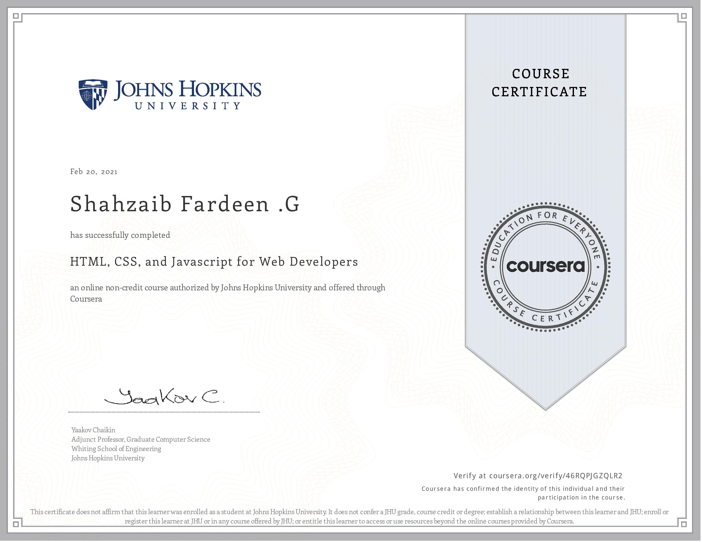

# HTML, CSS And JavaScript For Web Developers 

This Repository Contains My Solutions To The Assignments Of The Coursera Course.
["HTML, CSS, and Javascript for Web Developers"](https://www.coursera.org/learn/html-css-javascript-for-web-developers).

## Assignments :-

### Module 2
* [Assignment description](./Descriptions/Assignment2/Assignment-2.md)
* [Solution](https://shahzaibfardeen.github.io/HTML_CSS_And_JavaScript_For_Web_Developers/Module_2_Solution/)

### Module 3
* [Assignment description](./Descriptions/Assignment3/Assignment-3.md)

* [Basic Solution (without most of the optional parts)](https://goggle.github.io/Coursera_HTML-CSS-Javascript-for-Web-Developers/module3_solution/index_basic.html)

* [Full Solution (including all the optional parts)](https://goggle.github.io/Coursera_HTML-CSS-Javascript-for-Web-Developers/module3_solution/)

### Module 4
* [Assignment description](./Descriptions/Assignment4/Assignment-4.md)
* [Solution](https://goggle.github.io/Coursera_HTML-CSS-Javascript-for-Web-Developers/module4_solution/)

### Module 5
* [Assignment description](./Descriptions/Assignment5/Assignment-5.md)
* [Solution](https://goggle.github.io/Coursera_HTML-CSS-Javascript-for-Web-Developers/module5_solution/)

### Course Completion Certificate

